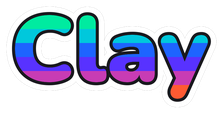
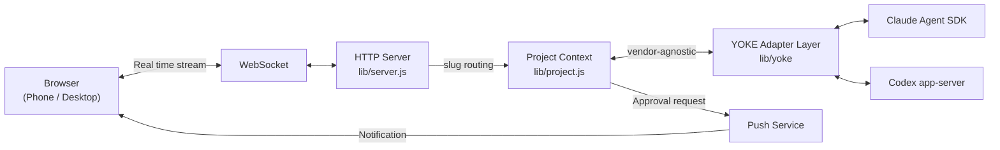

<p align="center">
  
</p>

<h2 align="center">The power layer for Claude Code and Codex.</h2>
<h4 align="center">A team workspace, self-hosted on your machine. One toggle between vendors. No lock-in.</h4>

<p align="center">
  <a href="https://www.npmjs.com/package/clay-server"></a>
  <a href="https://www.npmjs.com/package/clay-server"></a>
  <a href="https://github.com/chadbyte/clay"></a>
  <a href="https://github.com/chadbyte/clay/blob/main/LICENSE"></a>
</p>

<p align="center"></p>

Clay is a team workspace for Claude Code and Codex, self-hosted on your machine. Onboard your team to one tool, share sessions live, switch vendors with a toggle. Your code, your Mates, your decisions, all on disk.

```bash
npx clay-server
# Scan the QR code to connect from any device
```

## Why Clay

**One workspace, many people.** Your whole team logs into the same workspace, not a personal editor with billing settings bolted on. Multi-user from day one, with OS-level isolation on Linux.

**Many projects at once.** If you bounce between repos all day, keep them all loaded in one place and run agents in parallel across them. Permission requests and completed jobs surface as notifications so nothing goes silent in a tab you forgot to check.

**Self-hosted.** Clay is a daemon on your machine. Your code, your sessions, your AI teammates' memory all live on disk in plain JSONL and Markdown. No proprietary database. No cloud relay. No middleman.

**Vendor-agnostic.** Run Claude Code and Codex in the same workspace. Toggle vendors per session. When Anthropic raises prices or OpenAI changes terms, your workflow keeps moving. Same Mates, same projects, same memory, different model.

**No lock-in.** Plain files you can grep, version, and back up. Standard cron expressions. MCP servers you already use. CLAUDE.md, AGENTS.md, .cursorrules, all loaded automatically across vendors. Walk away whenever you want, your data walks with you.

## Built for Teams

Clay is the workspace your team logs into, not a private editor with billing settings bolted on. Provision a server, invite your team, work in one place.

- **Multi-user on a single server.** One Clay daemon hosts everyone on your team. No per-seat SaaS, no separate installs. Add users, they log in, they're in.
- **OS-level isolation on Linux.** Opt in to provision each Clay user as a real Linux account. File ACLs are enforced via `setfacl`. Processes spawn under the right UID/GID. The isolation guarantees come from the OS, not from a promise in our docs.
- **Each member brings their own login.** Share one org-wide API key, or let each user sign in with their own Claude Code or Codex account. Costs route to whoever ran the model.
- **Drop into a teammate's session to help.** When someone gets stuck, jump into their project and pair in real time. Shared control, full history, no screen-share theater.
- **@mention a teammate when you're stuck.** Ping them right inside the session. Their notification center lights up, their phone buzzes. No teammate around? @mention a Mate instead, same gesture, same place.
- **Non-developers welcome.** PMs, designers, support engineers can log in to ask questions about the codebase, create issues, or read what the team built, without ever opening an editor.

## What it does

### Run Claude Code and Codex in one workspace

Open a session, pick a vendor. Switch sessions, pick the other. Clay's adapter layer (YOKE) speaks the Claude Agent SDK and the Codex app-server protocol natively. Cross-vendor instruction loading: Codex reads AGENTS.md, Claude reads CLAUDE.md, Clay merges the rest into the system prompt automatically.

<p align="center">
  
</p>

### Every project on one dashboard

All your projects live in the sidebar. Jump between them in one click, see live status across each, run agents in several at once. No more `cd ~/work/foo && tmux attach && ...`. One Clay daemon hosts every repo on your machine and gives you a single pane of glass over all of them.

### Mates: AI teammates with persistent memory

Mates are AI personas with their own CLAUDE.md, knowledge files, and memory that compounds across sessions. They learn your stack, your conventions, your decision history. @mention them mid-session, DM them directly, or drop them into a debate. **They don't flatter you. They push back.**

### Debate: structured multi-Mate decisions

Stuck on REST vs GraphQL? Monorepo or split? Surface the question to a debate. Pick panelists, set the format, let your Mates argue both sides with moderated turns. You walk away with a recorded decision, not a vibe check.

### Parallel worktrees

Detect existing git worktrees, spin up new ones from the sidebar, and run agents in each one independently. No more "wait, I have uncommitted changes." Each worktree is an isolated session with its own history.

### Ralph Loop: autonomous coding while you sleep

Write a `PROMPT.md`, optionally a `JUDGE.md`, hit go. Clay iterates: code, evaluate, retry, until the judge approves or you cap the loop. Run it once, or schedule it on standard Unix cron. Wake up to a finished feature or a clean failure trace.

### Web UI, mobile, push notifications

Installable PWA on iOS and Android. Push notifications for approvals, errors, and completed tasks. Service worker keeps the app responsive offline. When Claude needs approval, your phone buzzes, you tap approve, the agent keeps going.

<p align="center">
  
</p>

## Who is Clay for

- **Teams that want one shared workspace, not one editor each.** Onboard your whole team to a single tool, share sessions, set permissions per person, keep code on your own infrastructure.
- **Teams hedging vendor risk.** You want Claude today, Codex tomorrow, and the freedom to flip without rewriting your workflow.
- **Self-hosting developers who won't put their code in someone else's cloud.** You run the server, you own the data, you pick the model.
- **Codex users tired of CLI-only workflows.** Clay treats Codex as a first-class citizen, not a Claude afterthought.
- **Solo developers building an AI team.** Mates, Debate, and Ralph Loop give you reviewers, decision-makers, and an autonomous coding partner. Your team grows when you're ready.

## Getting Started

**Requirements:** Node.js 20+. Authenticated Claude Code CLI, Codex CLI, or both.

```bash
npx clay-server
```

On first run, Clay asks for a port and whether you're solo or with a team. Open the URL or scan the QR code from your phone.

For remote access, use a VPN like Tailscale.

<p align="center">
  
</p>

## CLI Options

```bash
npx clay-server              # Default (port 2633)
npx clay-server -p 8080      # Specify port
npx clay-server --yes        # Skip interactive prompts (use defaults)
npx clay-server -y --pin 123456
                              # Non-interactive + PIN (for scripts/CI)
npx clay-server --add .      # Add current directory to running daemon
npx clay-server --remove .   # Remove project
npx clay-server --list       # List registered projects
npx clay-server --shutdown   # Stop running daemon
npx clay-server --dangerously-skip-permissions
                              # Bypass all permission prompts (requires PIN at setup)
```

Run `npx clay-server --help` for all options.

## FAQ

**"Is this a Claude Code wrapper?"**
No. Clay drives Claude Code through the [Claude Agent SDK](https://www.npmjs.com/package/@anthropic-ai/claude-agent-sdk) and Codex through the Codex app-server protocol. Both are first-class. Clay adds multi-session orchestration, persistent Mates, structured debates, scheduled agents, multi-user collaboration, built-in MCP servers, and a full browser UI on top.

**"Can I run Claude Code and Codex in the same workspace?"**
Yes. Pick a vendor when you open a session. Switch per session. Same projects, same Mates, same memory.

**"Does my code leave my machine?"**
Only as model API calls (the same as using the CLI directly). Sessions, Mates, knowledge, and settings all stay on disk.

**"Does my existing CLAUDE.md / AGENTS.md / .cursorrules work?"**
Yes. Clay loads native instruction files for each vendor and merges the rest into the system prompt automatically.

**"Can I continue a CLI session in the browser?"**
Yes. CLI sessions show up in the sidebar. Browser sessions can be picked up in the CLI.

**"Does each teammate need their own API key?"**
No. Share one org-wide key, or let each user bring their own. On Linux with OS-level isolation, each member can also use their own Claude Code or Codex login.

**"What does OS-level isolation actually do?"**
On Linux, opt in and Clay provisions each user as a real Linux account. File ACLs are enforced via `setfacl`, agent processes spawn under the user's UID/GID, and the kernel handles the rest. One teammate can't read another's project files, even by accident. The guarantee comes from the OS, not from a promise in our code.

**"Does it work with MCP servers?"**
Yes. User-configured MCPs from `~/.clay/mcp.json` plus built-in browser, email, ask-user, and debate servers. All work in both Claude and Codex sessions.

**"Can I use it on my phone?"**
Yes. Install as a PWA on iOS or Android. Push notifications for approvals, errors, and task completion.

**"What is d.clay.studio in my browser URL?"**
A DNS-only service that resolves to your local IP for HTTPS certificate validation. No data passes through it. All traffic stays between your browser and your machine. See [clay-dns](clay-dns/) for details.

## Our Philosophy

One idea: **user experience sovereignty**.

Not a grand statement. A simple wish: not to have your thinking, your work, and your data locked in the moment a vendor changes a price or rewrites a ToS.

That shows up in the technical choices we made:

- **Your machine is the server.** Browser → your daemon → model API. That's the full chain. No vendor cloud, no relay server, no middle tier syncing your sessions through someone else's infrastructure.
- **One toggle between vendors.** The adapter layer (YOKE) speaks the Claude Agent SDK and the Codex app-server protocol natively. Switching is a setting, not a migration.
- **Plain text on disk.** Sessions, Mates, knowledge, and settings live as JSONL and Markdown. No proprietary database. You can `cat`, `grep`, version, and back up everything yourself.
- **Standard formats only.** CLAUDE.md, AGENTS.md, `.cursorrules`, MCP, Unix cron. If you walk away from Clay, your data walks with you in formats every other tool already understands.

That's the principle. The rest of the README is what it makes possible.

## Architecture

Clay drives Claude Code through the [Claude Agent SDK](https://www.npmjs.com/package/@anthropic-ai/claude-agent-sdk) and Codex through the Codex app-server protocol, then streams both to the browser over WebSocket.



For detailed sequence diagrams, daemon architecture, and design decisions, see [docs/architecture.md](docs/architecture.md).

## Community Projects

Projects built by the community on top of Clay.

| Project | Description |
|---------|-------------|
| [clay-streamdeck-plugin](https://github.com/egns-ai/clay-streamdeck-plugin) | Stream Deck plugin that turns physical buttons into a live dashboard for managing Clay sessions, worktrees, and permission requests. |

Building something with Clay? Share it in [Discussions](https://github.com/chadbyte/clay/discussions).

## Contributors

<a href="https://github.com/chadbyte/clay/graphs/contributors">
  
</a>

## Contributing

Bug fixes and typo corrections are welcome. For feature suggestions, please open an issue first:
[https://github.com/chadbyte/clay/issues](https://github.com/chadbyte/clay/issues)

If you're using Clay, let us know how in Discussions:
[https://github.com/chadbyte/clay/discussions](https://github.com/chadbyte/clay/discussions)

## Disclaimer

Not affiliated with Anthropic or OpenAI. Claude is a trademark of Anthropic. Codex is a trademark of OpenAI. Provided "as is" without warranty. Users are responsible for complying with their AI provider's terms of service.

## License

MIT
